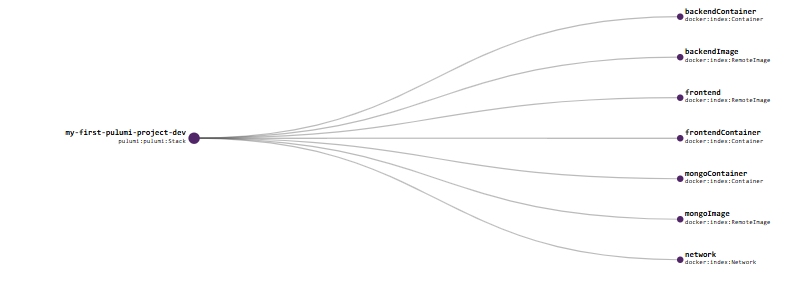

Title: Getting Started with Pulumi: Multi-Container Application with Docker Images

Introduction

This project demonstrates the fundamentals of infrastructure as code (IaC) with Pulumi by deploying a multi-container application consisting of frontend, backend, and MongoDB services. It leverages Docker images to provide a portable and consistent environment across deployments.
Buid using Typescript template and
starting point of code is `index.ts`

Prerequisites

[A Pulumi account](https://www.pulumi.com/)

[Pulumi CLI installed](https://www.pulumi.com/docs/iac/download-install/)

[Docker installed](https://docs.docker.com/desktop/setup/install/windows-install/)

Getting Started

Clone the Repository:

```Bash
git clone https://github.com/amarpreetbhatia/my-first-pulumi-project.git
cd my-first-pulumi-project
```

If you need to provide credentials or other sensitive information, use the pulumi config set command depended ont this project:

```Bash
pulumi config set frontendPort 3001
pulumi config set backendPort 3000
pulumi config set mongoPort 27017
pulumi config set mongoHost mongodb://mongo:27017
pulumi config set database cart
pulumi config set nodeEnvironment development
pulumi config set protocol http://
```

Preview Infrastructure Changes:

```Bash
pulumi preview
```

This command provides a detailed breakdown of the infrastructure changes that Pulumi will make based on your current configuration.

Deploy Infrastructure (Pulumi Up):

```Bash
pulumi up
```

This command creates the infrastructure resources as defined in your Pulumi program. Pulumi will automatically manage the creation and deletion of resources as needed.

Testing and Verification

Once the infrastructure is deployed, follow the steps specific to your application to access the deployed services (e.g., port forwarding, container logs).
Thoroughly test your application's functionality in this Pulumi-managed environment.
Destroying Infrastructure (Pulumi Destroy):

```Bash
pulumi destroy
```

This command safely removes the infrastructure resources created by your Pulumi stack.

Additional Notes:

For more advanced configurations, explore Pulumi's features for secrets management, configuration management, and integrations with other tools.
The provided Pulumi program template (docker) serves as a starting point. You can customize it to meet your specific needs.
Further Learning

Pulumi Documentation: https://www.pulumi.com/docs/
Docker Documentation: https://docs.docker.com/
Pulumi Examples: https://github.com/pulumi/examples

By following these steps and leveraging Pulumi's capabilities, you can efficiently deploy and manage multi-container applications using modern infrastructure as code practices.



This Project is build following:
https://www.pulumi.com/tutorials/pulumi-fundamentals/
